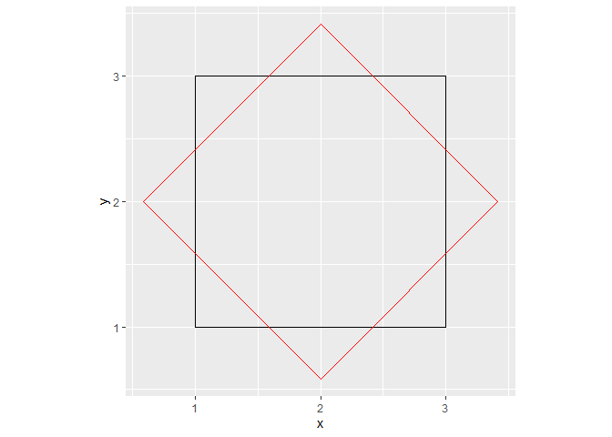

# Reproducing Schotter in R
I have been captivated by creative coding and generative art for a
while. After discovering some of the work by [Antonio
S.Chinchón](https://twitter.com/aschinchon) and his blog
[Fronkonstin](https://fronkonstin.com/) on usign R and mathematics to
creat amazing art work, I decided to play around.
[Schotter](http://www.medienkunstnetz.de/works/schotter/) (1968) is a
famous piece by [Georg Nees](https://en.wikipedia.org/wiki/Georg_Nees),
a pioner in computer graphics and probably one of the first creative
coders.

[**CHECK THE ORIGINAL
NOW**](http://www.medienkunstnetz.de/works/schotter/)

To pay tribute to Georg, I decided to implement a chunk of code that
would reproduce Schotter using R. There are probably several ways to
code this algorithm and I am sure several people have done this before.
My goal was to see if my current R knowledge could be use to program
Schotter without checking other implementations and learn something on
the way.

Here my thought process.

The libraries
-------------

Nowadays I use [ggplot2](https://ggplot2.tidyverse.org/) for every
visualization, so I decided to utilize its amazing graphical powers. I
also used [dplyr](https://dplyr.tidyverse.org/) although we could easily
not use it here.

    library(ggplot2)
    library(dplyr)

Building a square
-----------------

The easiest way to build a square in ggplot2 is probably using
*geom\_rect*, however I did not find a way to rotate the geometry, so I
decided to go for a polygon (*geom\_polygon*) and control the position
of the 4 vertex outsite ggplot. For that I created the following
function:

    square<-function(x0=1,y0=1, size=1, angle=0){
      xor<-x0+size/2 #X origin (center of the square)
      yor<-y0+size/2 #Y origin (center of the square)
      
      tibble(
        x=c(x0,x0+size,x0+size,x0),
        y=c(y0,y0,y0+size,y0+size)
      )%>%mutate(x2=(x-xor)*cos(angle)-(y-yor)*sin(angle)+xor, #For rotation
                 y2=(x-xor)*sin(angle)+(y-yor)*cos(angle)+yor) #for rotation
    }

Where **x0** and **y0** control the position of lower left (or other
depending on the axis orientation) vertex, size the lenght of the sides
and angle the amount of rotation from the original position. An **x**
and **y** for each vertex is set as a template relative to **x0**,
**y0** and size. In this way, we will be able to control the position of
the square in the canvas. **x2** and **y2** are set as the rotated
coordinates for **x** and **y**, respectively. Ultimately, we will use
**x2** and **y2**, that will be equal to **x** and **y** if angle is 0.
I decided to generate new columns for the rotations so I can plot both,
the original x,y and the rotated (I confess I had to brush up my
trigonometry and google a few things for this).

    ggplot(square())+
      geom_polygon(aes(x=x, y=y))+
      coord_fixed()# just so that axis are equally spaced

We have our first square!! We can now play with fill and color

    ggplot(square())+
      geom_polygon(aes(x=x, y=y), fill=NA, color='black')+
      coord_fixed()

Let’s play with some parameters

    ggplot(square(size=2,angle=pi/4))+#size 2 and rotate 45 degrees
      geom_polygon(aes(x=x, y=y), fill=NA, color='black')+
      geom_polygon(aes(x=x2, y=y2), fill=NA, color='red')+
      coord_fixed()

How many squares we want?
-------------------------

Schotter can be seen as a matrix of squares. A simple way to iterate
through a matrix is to nest a loop inside a loop such that one loop goes
through the rows and another through the columns.

The original Schotter has 12 columns and 24 rows (that I counted)

    n<-24*12
    df.list<-list()
      for (j in 1:24){ #iterate through the rows
        for (i in 1:12){ #iterate through the columns
          temp<-square(x=i, y=j) #create a square at column i and row j
          df.list[[n]]<-temp #save the data frame with the square n on a list
          n<-n-1
        }
      }

This chunk creates a data frame containing the four **x**, **y**, **x2** and
**y2** for 288 (24x12) squares, that we can plot. To plot each square
independently as we will do later, we need to add a new
*geom\_polygon* layer for each square to a ggplot object. We could have
done this in the previous loops, but in the course of this mini project
I have learned that you can pass a list to ggplot. So, we can iterate
though our list of square data frames using lapply and add a
*geom\_polygon* for each square (a bit slow on my friend).

    ggplot() + 
      lapply(df.list, function(square_data) {
        geom_polygon(data = square_data, aes(x = x2, y = y2), fill=NA, color='black')}
      )+
      coord_fixed()

Now we have the grid of squares. At this point I have decided to deal
with the unecessary elements of the plot. I generated a theme function
such that I can easely change the background color.

    theme_background<-function(color='white'){
      theme(axis.ticks = element_blank(), axis.text = element_blank(),
            panel.background = element_blank(), panel.grid = element_blank(),
            plot.background = element_rect(fill = color),
            strip.background = element_rect(fill=color),strip.text = element_blank(),
            axis.title = element_blank(), legend.position = 'none')
    }

    ggplot() + 
      lapply(df.list, function(square_data) {
        geom_polygon(data = square_data, aes(x = x2, y = y2), fill=NA, color='black')}
      )+
      coord_fixed()+
      theme_background()

Generative process
------------------

Generative art is defined by wikipedia as:

    Generative art refers to art that in whole or in part has been created with the use of an autonomous system. An autonomous system in this context is generally one that is non-human and can independently determine features of an artwork that would otherwise require decisions made directly by the artist. 

An easy way to give autonomy to our code is by introducing randomness.
As we can appreciate from Schotter, both the position and the angle of
the squares seems to be more random and move away from the ‘calm’ stage
as we move through the rows. We will add this to our nested loops by
generating a random displacement and rotation for each square that
increases by row.

    n<-24*12
    df.list<-list()
      for (j in 1:24){ #iterate through the rows
        for (i in 1:12){ #iterate through the columns
          displace<-runif(1,-j,j) #a random number is generated from a uniform distribution with min=-j and max=j
          rotate<-runif(1,-j,j) #random number to rotate the square
          temp<-square(x=i+displace, y=j+displace, angle=rotate) #create a square at column i and row j displaced by displace
          df.list[[n]]<-temp #save the data frame with the square n on a list
          n<-n-1
        }
      }

    ggplot() + 
      lapply(df.list, function(square_data) {
        geom_polygon(data = square_data, aes(x = x2, y = y2), fill=NA, color='black')}
      )+
      coord_fixed()+
      theme_background()

Ups! Something isn’t quite right (although I like it!). I think is
because *j*, that controls how much displacement and rotation can be
added gets to be too big in respect to **x** and **y**. So, let’s control
for that. I devided *j* by 40 in the case of displace and by
100 in the case of rotate. I found these numbers by playing around. I
also flipped y axis.

    n<-24*12
    df.list<-list()
      for (j in 1:24){ #iterate through the rows
        for (i in 1:12){ #iterate through the columns
          displace<-runif(1,-j/40,j/40) #a random number is generated from a uniform distribution with min=-j and max=j
          rotate<-runif(1,-j/100,j/100) #random number to rotate the square
          temp<-square(x=i+displace, y=j+displace, angle=rotate) #create a square at column i and row j displaced by displace
          df.list[[n]]<-temp #save the data frame with the square n on a list
          n<-n-1
        }
      }

    ggplot() + 
      lapply(df.list, function(square_data) {
        geom_polygon(data = square_data, aes(x = x2, y = y2), fill=NA, color='black')}
      )+
      coord_fixed()+
      theme_background()+
      scale_y_reverse()

And *voila*! we have coded a generative algorithm to produce something
like Schotter. Because the randomness, every time we run the code, the
result will be different.

Now we wrap the code in a function so that we can easily change
some parameters

    Schotter<-function(ncol_s=12, nrow_s=24, control_dis=40, 
                       control_rot=100, fill_s=NA, color_s='black', alpha_s=0.2, 
                       back_color='white'){
    n<-ncol_s*nrow_s
    df.list<-list()
      for (j in 1:nrow_s){
        for (i in 1:ncol_s){
          displace<-runif(1,-j/control_dis,j/control_dis)
          rotate<-runif(1,-j/control_rot,j/control_rot)
          temp<-square(x=i+displace, y=j+displace, angle=rotate)
          temp$s<-rep(n)
          df.list[[n]]<-temp
          n<-n-1
        }
      }

    ggplot() + 
      lapply(df.list, function(square_data) {
        geom_polygon(data = square_data, aes(x = x2, y = y2),
                     alpha=alpha_s, fill=fill_s, color=color_s)}
      )+
      theme_background(color = back_color)+
      coord_fixed()+
      scale_y_reverse()
    }  

We can now play!

    Schotter()

    Schotter(fill='firebrick', color='orange', nrow_s = 48, control_dis = 20)

The End
-------

This is all for now. There are a few ways the code could be improved,
but I am happy with the result and I have had fun and learned something
new!

